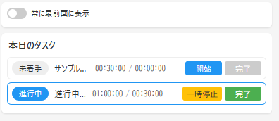

# Task Management Application

## 概要
タスクを管理、スケジュール、作業時間計測を行い、より開発速度を高めるためのツール。
個人開発者（特にゲーム開発者）向けに設計されています。

## 主な機能
- チケット管理
- スケジューリング
- 定期タスク管理
- 作業時間計測
- Notion連携

## 技術スタック
- プログラミング言語
  - TypeScript
  - JavaScript
- フレームワーク/ライブラリ
  - Electron v28.1.1
  - React v18.2.0
  - electron-store v8.1.0
- 開発ツール
  - Webpack v5.89.0
  - Babel v7.23.7
  - ESLint v8.56.0
  - Prettier v3.1.1
- 外部サービス
  - Notion API

## 画面イメージ
### Electronアプリケーション  
HTMLでコードも作っています。[こちら](docs/Layout_image/electron/index.html)を確認してください    


## ドキュメント
詳細な情報は以下のドキュメントを参照してください：

### ユーザー向け
- [ユーザーマニュアル](docs/manual.md) - インストール方法から使用方法まで

### アーキテクチャ
- [システム設計](docs/architecture/system-design.md) - システムアーキテクチャの詳細
- [クラス図](docs/architecture/class-diagram.md) - クラス構造とその関係
- [シーケンスフロー](docs/architecture/sequence-flow.md) - 主要な処理フロー

### 開発者向け
- [セットアップガイド](docs/development/setup.md) - 開発環境のセットアップ
- [コーディング規約](docs/development/coding-style.md) - コーディングスタイルガイド
- [開発ロードマップ](docs/development/roadmap.md) - 開発計画と進捗状況
- [Notion API仕様](docs/development/notion-api.md) - Notion連携の技術仕様

## クイックスタート
1. 必要な環境
   - Node.js (v16以上)
   - npm (v8以上)

2. インストール
   ```bash
   git clone https://github.com/sho-uver/task_management.git
   cd task_management
   npm install
   ```

3. 開発用コマンド
   ```bash
   # 開発モードでの起動
   npm run dev        # Webpackの開発サーバー起動
   npm run electron-dev  # 別ターミナルでElectronを起動

   # ビルド
   npm run build     # アプリケーションのビルド
   npm run pack      # パッケージ化（開発用）
   npm run dist      # 配布用パッケージの作成
   ```

