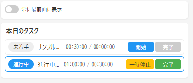
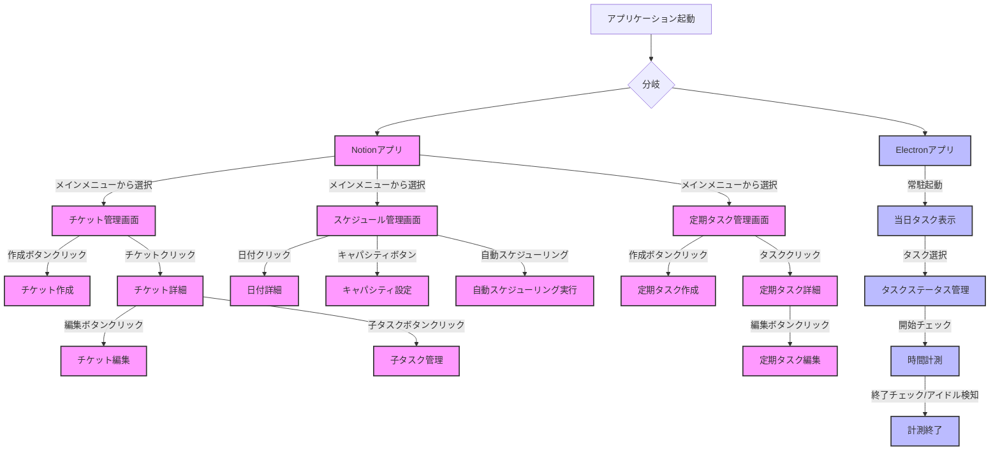
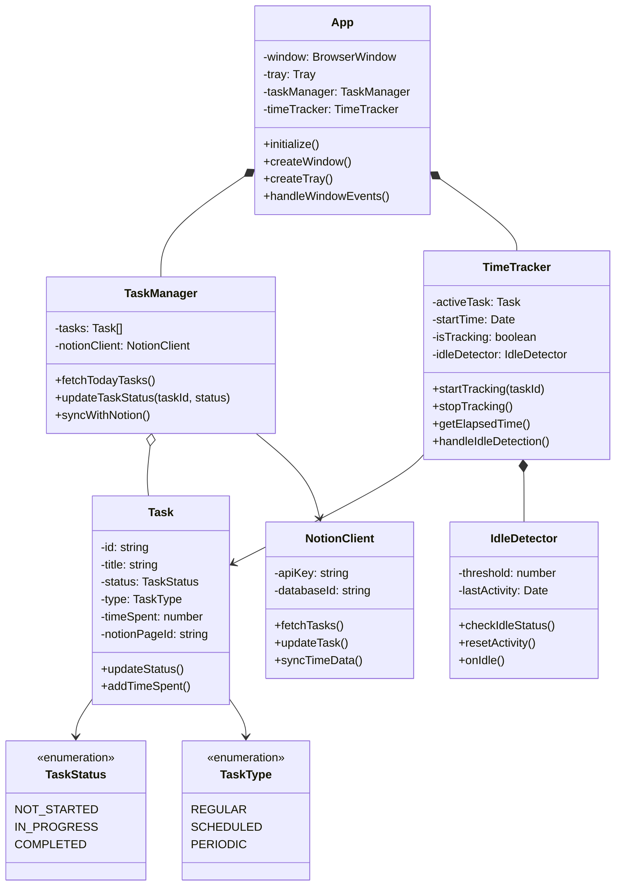
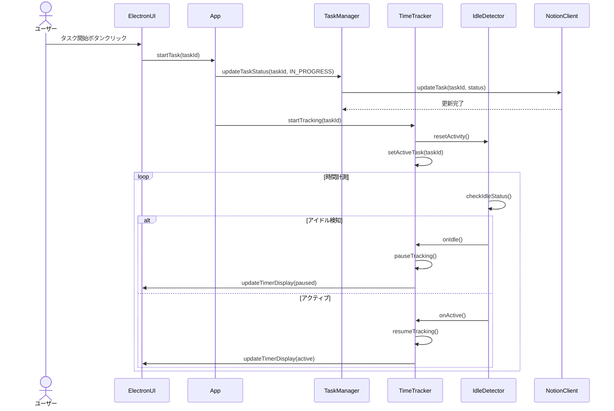
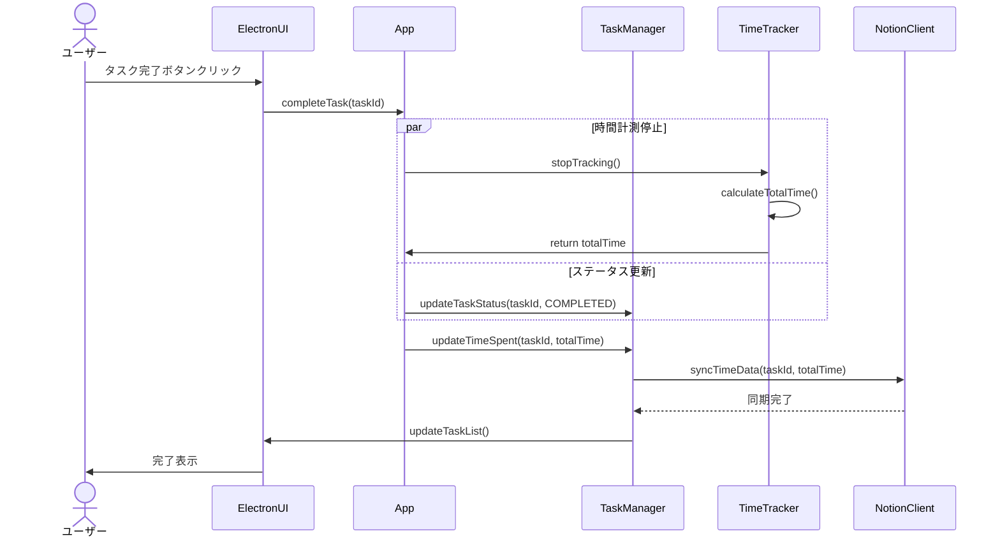
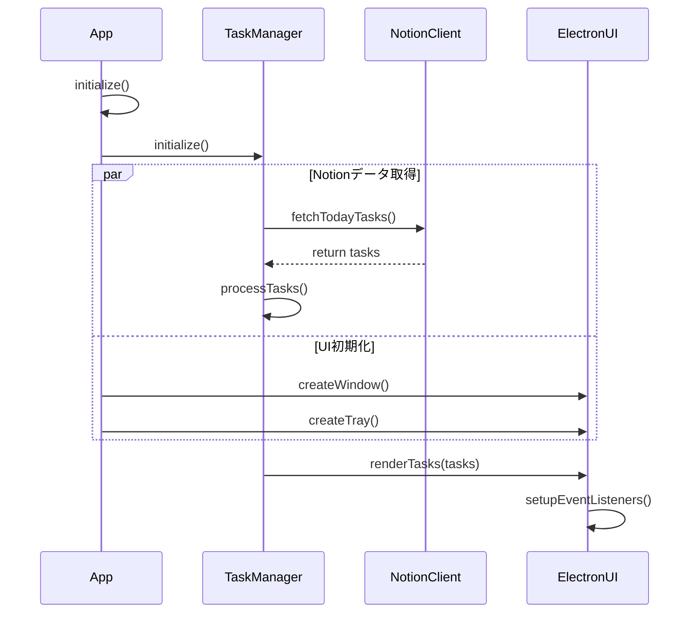

# task_management
## 概要
タスクを管理、スケジュール、作業時間計測を行い、より開発速度を高めるためのツール

## ターゲット
個人開発者(とくにゲーム)

## 画面イメージ
### Electronアプリケーション  
HTMLでコードも作っています。[こちら](doc/Layout_image/electron/index.html)を確認してください    
 

## プラットフォーム
- Windows
- Mac

## 使用言語等
- プログラミング言語:JavaScript
- フレームワーク:Electron
- 流用ツール:Notion

## 機能概要
- チケット管理
- スケジューリング
- 一定期間ごとのタスク管理
- 当日の作業時間計測

## 機能詳細
### チケット管理
- バックログ:画面を設けてチケットの一覧が見える
- チケット作成：作成ボタンを押すと新しいチケットを登録できる。登録する内容は以下の通り
    - 必須項目
        - タイトル
        - 状態:未着手、完了の二つの状態がある
        - 対応にかかる時間（hh:mm:ss形式）
        - 対応にかかった時間:当日の作業時間計測で計測した時間が自動で入る
        - 優先度:小さいほど優先度が高く、すべてのチケットで通し番号になる
    - 任意項目
        - 詳細内容
        - 開始日：手動で入力したらその日に配置される
        - 終了日：手動で入力したらその日に配置される
        - 作業時間内訳:当日の作業時間計測で何を見ていたかも記録し登録する
- ドラッグ&ドロップでの優先度変更
- 一覧フィルター:すべて、未着手、完了でフィルターをかけられる
- チケットの子タスク作成
### スケジューリング
- カレンダー表示
- 特定の日付に対してチケット追加
- キャパシティ入力：選択した日付に対してまとめてその日に何時間対応できるか入力できる
- 自動スケジューリング:キャパシティとチケットの対応にかかる時間をみて自動でいつ何をやるかカレンダーに入力する
- 日付ごとの備考入力
### 一定期間ごとのタスク管理
- 一定期間ごとに取り組むタスクについて登録:毎日、毎週など一定期間ごとに取り組むタスクを登録できる。一定期間のいつに実施するものなのかを設定できる
### 作業時間計測
#### 画面構成
- ウィンドウサイズ: 400x400px
- 常に最前面表示の切り替え機能

#### タスク一覧
- タスクの表示項目
  - ステータス（未着手/進行中）
  - タスク名
  - 見積時間（hh:mm:ss）
  - 実績時間（hh:mm:ss）
  - 操作ボタン
    - 開始/一時停止
    - 完了

#### 自動計測機能
- PC起動中に対応しているタスクの作業時間を自動計測
- 5分以上マウスやキーボードの操作がない場合は計測を一時停止
- タスク完了時に計測終了

## アーキテクチャ
Notion+JavaScriptで作成したツール
- Notion部分の機能
    - チケット管理
    - スケジューリング
    - 一定期間ごとのタスク管理
- JavaScriptで作成したツール
    - 当日の作業時間計測

## 画面構成
### メイン画面（Notion）
- チケット管理画面
  - バックログ一覧表示領域
    - フィルター機能（すべて、未着手、完了）
    - チケット作成ボタン
    - チケット一覧（ドラッグ&ドロップ可能）
  - チケット詳細表示/編集領域
    - 必須項目入力セクション
      - タイトル
      - 状態
      - 見積時間
      - 実績時間（自動計測）
      - 優先度
    - 任意項目入力セクション
      - 詳細内容
      - 開始日
      - 終了日
      - 作業時間内訳
    - 子タスク管理セクション

- スケジュール管理画面
  - カレンダー表示領域
    - チケットのドラッグ&ドロップ配置エリア
    - 日付ごとの備考表示
  - キャパシティ設定領域
    - 一括入力機能
    - 日別キャパシティ表示
  - 自動スケジューリングボタン

- 定期タスク管理画面
  - タスク一覧表示領域
  - タスク登録/編集フォーム
    - 周期設定（毎日、毎週など）
    - 実施タイミング設定

### 作業管理ウィンドウ（Electron）
- ウィンドウ設定
  - 最前面表示切り替えチェックボックス
- 当日タスク管理領域
  - タスク一覧表示
    - 定期タスク
    - スケジュール済みチケット
  - タスクステータス管理
    - 開始チェックボックス
    - 終了チェックボックス
- 作業時間計測領域
  - タスクごとの経過時間表示
  - 自動計測状態表示
    - アイドル検知インジケータ（5分無操作）

## 画面遷移図

### 画面遷移の説明
1. アプリケーション起動時
   - Notionアプリとelectronアプリが並行して起動
   - 両アプリは独立して動作するが、データは連携

2. Notion部分（メイン機能）
   - メインメニューから3つの主要機能へアクセス
   - 各機能内で詳細な操作が可能
   - チケット、スケジュール、定期タスクの相互連携

3. Electron部分（作業管理）
   - 常駐型アプリケーションとして動作
   - シンプルな操作フローで作業記録を実現
   - 自動的なステータス管理と時間計測

## クラス図（Electronパート）

### クラス構造の説明
1. アプリケーション構造
   - `App`: アプリケーションのメインクラス
     - ウィンドウとトレイの管理
     - 他のコンポーネントの初期化と統合
   - `TaskManager`: タスク管理の中核
     - Notionとの同期
     - タスクの状態管理
   - `TimeTracker`: 時間計測の中核
     - アイドル検知との連携
     - 作業時間の記録

2. データモデル
   - `Task`: タスクの基本構造
     - Notionとの連携用ID
     - 状態と時間の管理
   - `TaskStatus`: タスクの状態を定義
   - `TaskType`: タスクの種類を定義

3. ユーティリティ
   - `IdleDetector`: アイドル状態の検知
     - マウスとキーボードの監視
     - 閾値による判定
   - `NotionClient`: Notion APIとの通信
     - データの同期
     - 更新の管理

## シーケンス図
### タスク開始から計測までの流れ

### タスク完了時の同期フロー

### アプリケーション起動時のデータ同期

### シーケンス図の説明
1. タスク開始から計測まで
   - ユーザーのアクションから時間計測開始までの流れ
   - アイドル検知の継続的なチェック
   - UIの状態更新

2. タスク完了時の同期
   - 並行処理による効率的な完了処理
   - Notionとのデータ同期
   - UI更新の順序

3. アプリケーション起動時
   - 並行処理によるデータ取得とUI初期化
   - 効率的な初期化シーケンス
   - イベントリスナーの設定

## 開発プロセス
### フェーズ1: 基盤構築
1. プロジェクトセットアップ
   - [x] プロジェクト構造の設計
   - [x] 基本設計ドキュメントの作成
   - [x] 開発環境の構築（JavaScript + React + Electron）
   - [x] package.jsonの設定
   - [x] ビルド設定の構築

2. Electron基盤実装
   - [x] メインプロセスの実装（main.js）
   - [x] レンダラープロセスの基本構造実装
   - [x] プロセス間通信の実装
   - [x] アプリケーションのパッケージング設定

### フェーズ2: UI実装
1. 画面コンポーネント実装
   - [x] ヘッダー部分の実装
   - [x] タスクリストの実装
   - [x] タスクアイテムの実装
   - [ ] 共通UI要素の実装

2. イベント処理
   - [x] UIイベントハンドラーの実装
   - [ ] データの永続化処理の実装
   - [ ] 設定の保存と読み込み

### フェーズ3: 機能実装
1. タスク管理機能
   - [ ] タスクの表示
   - [ ] タスクの開始/一時停止
   - [ ] タスクの完了処理
   - [ ] 作業時間の計測

2. 自動化機能
   - [ ] アイドル検知の実装
   - [ ] 自動一時停止の実装
   - [ ] バックグラウンド処理の実装

### フェーズ4: Notion連携
1. Notion API連携
   - [ ] API接続基盤の実装
   - [ ] タスクデータの同期機能
   - [ ] 作業時間の同期機能

2. データ同期
   - [ ] 定期的な同期処理の実装
   - [ ] エラーハンドリングの実装
   - [ ] 競合解決の実装

### フェーズ5: 最適化とテスト
1. パフォーマンス最適化
   - [ ] メモリ使用量の最適化
   - [ ] 起動時間の最適化
   - [ ] 同期処理の最適化

2. テスト実装
   - [ ] ユニットテストの実装
   - [ ] 統合テストの実装
   - [ ] E2Eテストの実装

### フェーズ6: 配布準備
1. パッケージング
   - [ ] Windows用ビルド設定
   - [ ] Mac用ビルド設定
   - [ ] 自動アップデート機能の実装

2. ドキュメント整備
   - [ ] インストールガイドの作成
   - [ ] 使用方法ドキュメントの作成
   - [ ] APIドキュメントの作成

