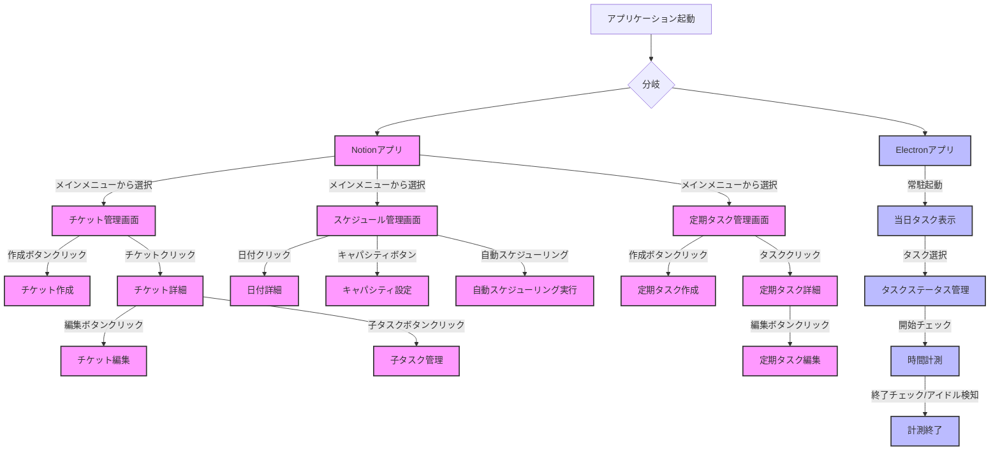

# task_management
## 概要
タスクを管理、スケジュール、作業時間計測を行い、より開発速度を高めるためのツール

## ターゲット
個人開発者(とくにゲーム)

## プラットフォーム
- Windows
- Mac

## 使用言語等
- プログラミング言語:JavaScript
- フレームワーク:Electron
- 流用ツール:Notion

## 機能概要
- チケット管理
- スケジューリング
- 一定期間ごとのタスク管理
- 当日の作業チェックリスト&当日の作業時間計測

## 機能詳細
### チケット管理
- バックログ:画面を設けてチケットの一覧が見える
- チケット作成：作成ボタンを押すと新しいチケットを登録できる。登録する内容は以下の通り
    - 必須項目
        - タイトル
        - 状態:未着手、完了の二つの状態がある
        - 対応にかかる時間
        - 対応にかかった時間:当日の作業時間計測で計測した時間が自動で入る。
        - 優先度:小さいほど優先度が高く、すべてのチケットで通し番号になる
    - 任意項目
        - 詳細内容
        - 開始日：手動で入力したらその日に配置される
        - 終了日：手動で入力したらその日に配置される
        - 作業時間内訳:当日の作業時間計測で何を見ていたかも記録し登録する
- ドラッグ&ドロップでの優先度変更
- 一覧フィルター:すべて、未着手、完了でフィルターをかけられる
- チケットの子タスク作成
### スケジューリング
- カレンダー表示
- 特定の日付に対してチケット追加
- キャパシティ入力：選択した日付に対してまとめてその日に何時間対応できるか入力できる
- 自動スケジューリング:キャパシティとチケットの対応にかかる時間をみて自動でいつ何をやるかカレンダーに入力する
- 日付ごとの備考入力
### 一定期間ごとのタスク管理
- 一定期間ごとに取り組むタスクについて登録:毎日、毎週など一定期間ごとに取り組むタスクを登録できる。一定期間のいつに実施するものなのかを設定できる
### 当日の作業チェックリスト&当日の作業時間計測
- 別ウィンドウでの表示
- ウィンドウを最前面に表示：例えばブラウザを開いて操作しているときも最前面に出てきてくれるようにする。チェックボックスで最前面しなくすることもできる。
- 当日のタスク表示：その日にやる一定期間ごとのタスクをチケットを表示する。
- タスク開始チェックボックス：開始されたら押す。
- タスク終了チェックボックス：終了したら押す。
- 事件計測機能：PC起動中に対応しているタスクにチェックをつけたらそのタスクの作業時間として計測される。5分以上マウスやキーボードの操作がない場合計測が止まる、タスク終了チェックボックスにチェックが付いたら計測終了。
- 時間表示:タスクごとに現在かかっている時間を表示する

## アーキテクチャ
Notion+JavaScriptで作成したツール
- Notion部分の機能
    - チケット管理
    - スケジューリング
    - 一定期間ごとのタスク管理
- JavaScriptで作成したツール
    - 当日の作業チェックリスト&当日の作業時間計測

## 画面構成
### メイン画面（Notion）
- チケット管理画面
  - バックログ一覧表示領域
    - フィルター機能（すべて、未着手、完了）
    - チケット作成ボタン
    - チケット一覧（ドラッグ&ドロップ可能）
  - チケット詳細表示/編集領域
    - 必須項目入力セクション
      - タイトル
      - 状態
      - 見積時間
      - 実績時間（自動計測）
      - 優先度
    - 任意項目入力セクション
      - 詳細内容
      - 開始日
      - 終了日
      - 作業時間内訳
    - 子タスク管理セクション

- スケジュール管理画面
  - カレンダー表示領域
    - チケットのドラッグ&ドロップ配置エリア
    - 日付ごとの備考表示
  - キャパシティ設定領域
    - 一括入力機能
    - 日別キャパシティ表示
  - 自動スケジューリングボタン

- 定期タスク管理画面
  - タスク一覧表示領域
  - タスク登録/編集フォーム
    - 周期設定（毎日、毎週など）
    - 実施タイミング設定

### 作業管理ウィンドウ（Electron）
- ウィンドウ設定
  - 最前面表示切り替えチェックボックス
- 当日タスク管理領域
  - タスク一覧表示
    - 定期タスク
    - スケジュール済みチケット
  - タスクステータス管理
    - 開始チェックボックス
    - 終了チェックボックス
- 作業時間計測領域
  - タスクごとの経過時間表示
  - 自動計測状態表示
    - アイドル検知インジケータ（5分無操作）

## 画面遷移図

### 画面遷移の説明
1. アプリケーション起動時
   - Notionアプリとelectronアプリが並行して起動
   - 両アプリは独立して動作するが、データは連携

2. Notion部分（メイン機能）
   - メインメニューから3つの主要機能へアクセス
   - 各機能内で詳細な操作が可能
   - チケット、スケジュール、定期タスクの相互連携

3. Electron部分（作業管理）
   - 常駐型アプリケーションとして動作
   - シンプルな操作フローで作業記録を実現
   - 自動的なステータス管理と時間計測