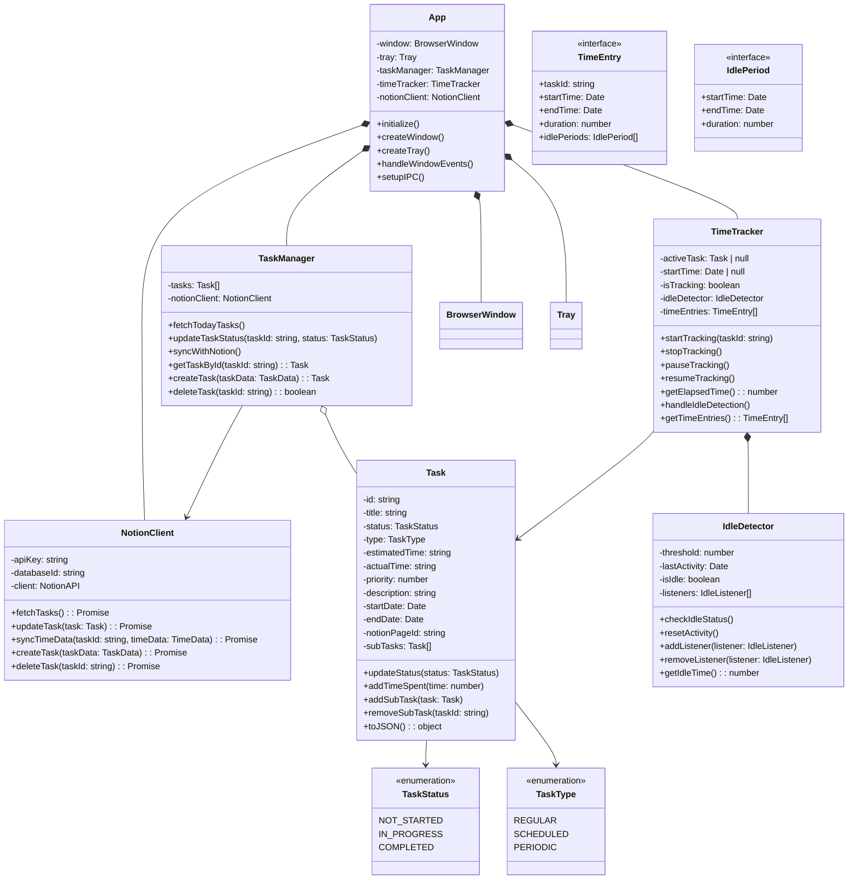

# クラス図とクラス構造

## 概要
このドキュメントでは、アプリケーションの主要なクラス構造と、それらの関係性について説明します。

## メインアプリケーション構造



## クラス詳細

### App クラス
メインアプリケーションのエントリーポイントとなるクラスです。

**責務:**
- アプリケーションの初期化
- ウィンドウとトレイの管理
- IPC（プロセス間通信）の設定
- 各マネージャークラスの統括

### TaskManager クラス
タスクの管理と永続化を担当するクラスです。

**責務:**
- タスクの作成、更新、削除
- Notionとのタスク同期
- タスクの状態管理
- タスクの検索と取得

### TimeTracker クラス
作業時間の計測と記録を担当するクラスです。

**責務:**
- 作業時間の計測
- アイドル状態の監視と処理
- 時間データの記録
- 計測データのエクスポート

### Task クラス
タスクのデータと操作を定義するクラスです。

**責務:**
- タスク情報の保持
- 状態変更の管理
- 作業時間の記録
- サブタスクの管理

### IdleDetector クラス
ユーザーの活動状態を監視するクラスです。

**責務:**
- アイドル状態の検知
- アクティビティの監視
- イベントリスナーの管理
- アイドル時間の計算

### NotionClient クラス
Notion APIとの通信を担当するクラスです。

**責務:**
- Notion APIとの通信
- データの同期
- タスクのCRUD操作
- エラーハンドリング

## 重要な関係性

1. **集約関係（Aggregation）**
   - `TaskManager` は複数の `Task` を管理
   - `TimeTracker` は複数の `TimeEntry` を管理

2. **コンポジション関係（Composition）**
   - `App` は `TaskManager` と `TimeTracker` を所有
   - `TimeTracker` は `IdleDetector` を所有

3. **依存関係（Dependency）**
   - `TaskManager` は `NotionClient` に依存
   - `Task` は `TaskStatus` と `TaskType` に依存

## データフロー

1. **タスク作成フロー**
   ```
   App -> TaskManager -> NotionClient -> Notion API
   ```

2. **時間計測フロー**
   ```
   TimeTracker -> IdleDetector -> TimeEntry -> TaskManager -> NotionClient
   ```

3. **同期フロー**
   ```
   NotionClient -> TaskManager -> App -> UI更新
   ``` 