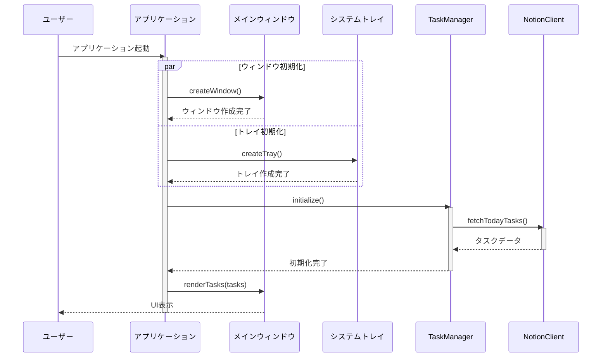
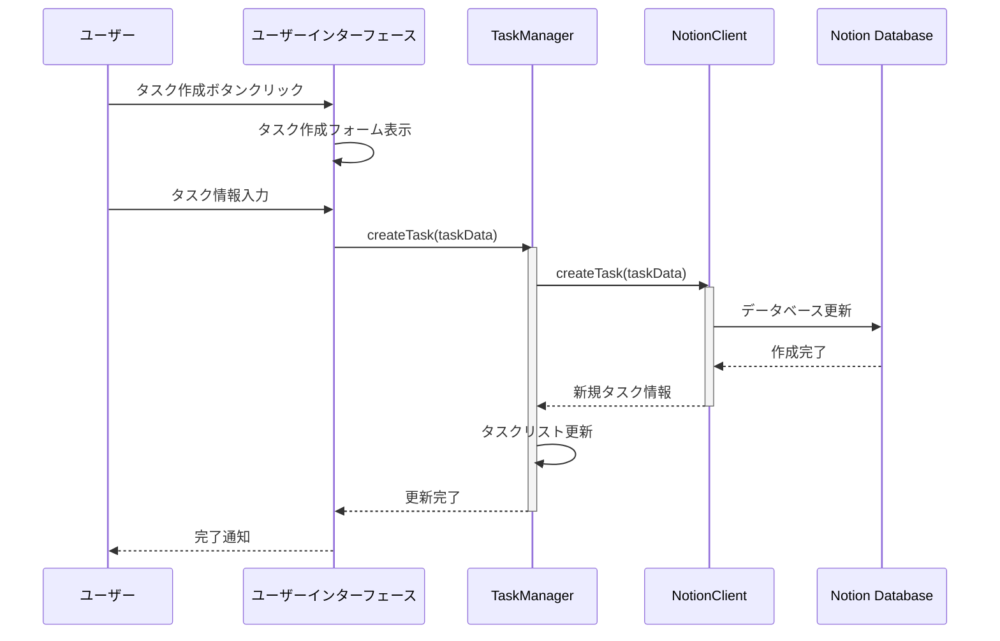
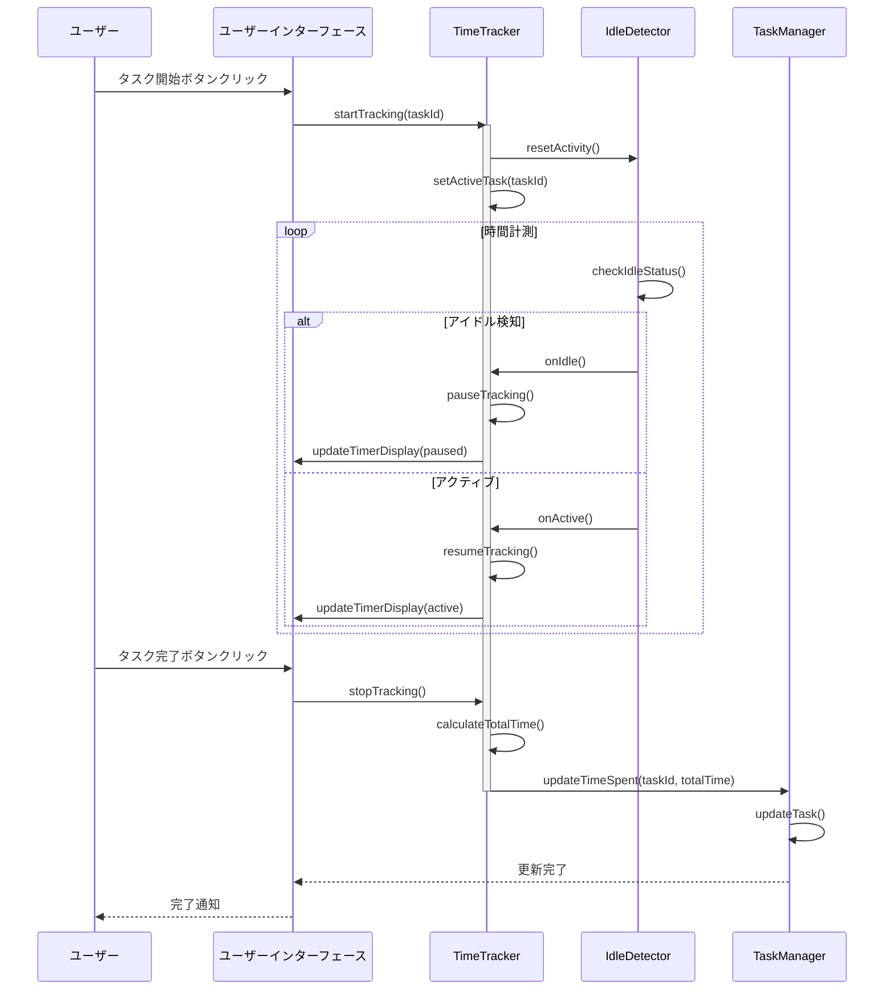
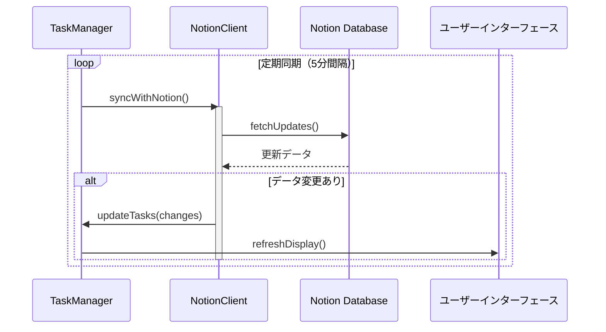
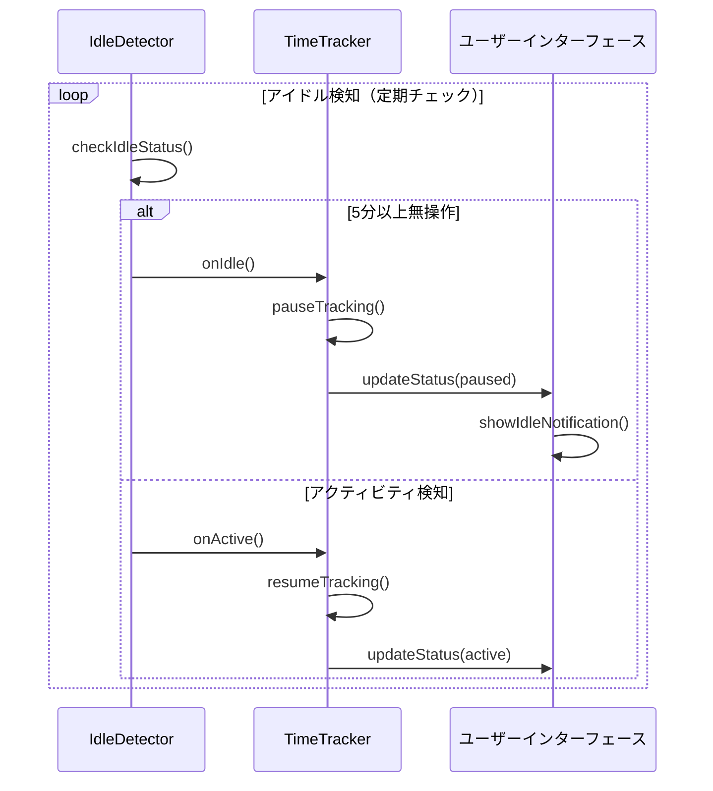

# シーケンス図と処理フロー

## 概要
このドキュメントでは、アプリケーションの主要な処理フローをシーケンス図で説明します。

## 1. アプリケーション起動フロー

## 2. タスク作成フロー

## 3. 作業時間計測フロー

## 4. Notion同期フロー

## 5. アイドル検知フロー

## 主要な処理フローの説明

### アプリケーション起動時の処理
1. メインウィンドウとシステムトレイの並行初期化
2. タスクマネージャーの初期化とNotionからのデータ取得
3. UIの初期表示

### タスク管理の処理
1. ユーザーによるタスク作成
2. Notionデータベースとの同期
3. UI更新の反映

### 時間計測の処理
1. タスク開始時の初期化
2. アイドル検知による自動一時停止/再開
3. 作業時間の記録と同期

### データ同期の処理
1. 定期的なNotion同期
2. 変更検知と差分更新
3. UI表示の更新

### アイドル検知の処理
1. 定期的なアクティビティチェック
2. 無操作時の自動一時停止
3. アクティビティ再開時の自動再開 