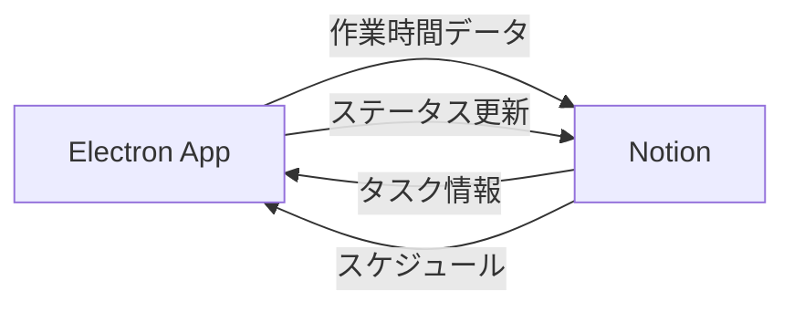

# システム設計書

## システム概要
タスク管理、スケジュール、作業時間計測を行い、より開発速度を高めるためのツール。
個人開発者（特にゲーム開発者）向けに設計されています。

## システムアーキテクチャ
### 全体構成
システムは以下の2つの主要コンポーネントで構成されています：

1. **Notion部分**
   - チケット管理
   - スケジューリング
   - 一定期間ごとのタスク管理

2. **Electronアプリケーション**
   - 当日の作業時間計測
   - タスク進捗管理
   - アクティビティ監視

### 技術スタック
#### プラットフォーム
- Windows
- Mac

#### 使用技術
- **プログラミング言語**
  - TypeScript
  - JavaScript

- **フレームワーク/ライブラリ**
  - Electron v28.1.1
  - React v18.2.0
  - electron-store v8.1.0

- **開発ツール**
  - Webpack v5.89.0
  - Babel v7.23.7
  - ESLint v8.56.0
  - Prettier v3.1.1

- **外部サービス**
  - Notion API

## コンポーネント設計

### 1. チケット管理システム
#### 主要機能
- バックログ管理
- チケット作成・編集
- 優先度管理
- 子タスク管理

#### データ構造
- チケット情報
  ```typescript
  interface Ticket {
    id: string;
    title: string;
    status: 'NOT_STARTED' | 'COMPLETED';
    estimatedTime: string; // "hh:mm:ss"
    actualTime: string;    // "hh:mm:ss"
    priority: number;
    description?: string;
    startDate?: Date;
    endDate?: Date;
    timeBreakdown?: TimeBreakdown[];
    subTasks?: Ticket[];
  }
  ```

### 2. スケジューリングシステム
#### 主要機能
- カレンダー表示
- キャパシティ管理
- 自動スケジューリング
- 日付別備考管理

#### データ構造
- キャパシティ情報
  ```typescript
  interface Capacity {
    date: Date;
    availableHours: number;
    notes?: string;
  }
  ```

### 3. 作業時間計測システム
#### 主要機能
- タスク進捗管理
- 自動時間計測
- アイドル検知
- Notion同期

#### データ構造
- 作業時間情報
  ```typescript
  interface TimeTracking {
    taskId: string;
    startTime: Date;
    endTime?: Date;
    totalTime: number;
    idlePeriods: IdlePeriod[];
  }
  ```

## システム間連携

### Notion - Electron間のデータフロー


### データ同期の仕組み
1. **定期同期**
   - スケジュールされたタスクの同期（5分間隔）
   - 作業時間の自動同期（タスク完了時）

2. **手動同期**
   - ユーザーによる同期実行
   - アプリケーション起動時の初期同期

## セキュリティ設計
1. **認証**
   - Notion APIトークンの安全な保管
   - アプリケーション設定の暗号化

2. **データ保護**
   - ローカルデータの暗号化
   - 通信の暗号化（HTTPS）

## パフォーマンス設計
1. **メモリ管理**
   - 効率的なデータキャッシング
   - 定期的なメモリクリーンアップ

2. **バックグラウンド処理**
   - 非同期データ同期
   - 効率的なイベント処理

## エラーハンドリング
1. **ネットワークエラー**
   - 自動再試行メカニズム
   - オフライン対応

2. **データ整合性**
   - 同期衝突の解決
   - データバックアップ

## 監視設計
1. **アプリケーション状態**
   - エラーログ
   - パフォーマンスメトリクス

2. **ユーザーアクティビティ**
   - 作業時間統計
   - アイドル検知ログ 